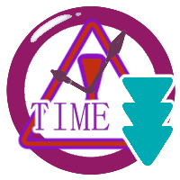

shootingGame
==============
This software is _Clicker-Shooting-Game_ written in Java.  
It is a game for exclusive use of the PCs.


## Table of Contents
  * [Requirements](#requirements)
  * [Setup](#setup)
  * [How To Play](#how-to-play)
  * [Command Line Option](#command-line-option)
  * [License](#license)
  * [Note](#note)
  * [Thank](#thank)

Requirements
-------------
This game requires the following to run:
  * JRE - [Java SE](https://www.oracle.com/technetwork/java/javase/downloads/index.html) 7 or higher
  * 2GB of RAM or higher

## Setup
**Download:**  
Executable-jar-file is here: https://github.com/ydk-nk/shootingGame/releases

**Launch in command line:**
```shell
java -jar syoribuShooting.jar
```

## How To Play
It is a shooting game that you hit the target by clicking.  
You get the score to hit the target in a limited time.  
If you hit the **center of target**, you get **x1.5** times the score!!

### Type of Targets

|Target|Description|
|:----:|:---:|
|       | Normal Target<br/> point:100|
|  | High Score Target<br/>point:300|
|   | Rare Target<br/>point:500|
|         | The item which increases the score at **x1.5** times during fixation time.|
|   | The item which reduces time.|

### Combo
When you hit the target **without making misstake**, the number of **combo increases**.  
**The larger combo, the easier gauge collect**

### Overheat mode
If the gauge become full, game into the **mode 'Overheat'**.  
With this mode, you get **score at x3 times!**  
The gauge gradually decreases, and finish 'Overheat' mode when gauge become empty.  


### Close the game
You can close the game to push X-button at the top right of the window,  
or press and hold key `Shift + ESC`.

## Command Line Option
  * `--nosounds` : Launch this game without playing sounds.
  * `--noframe` : Launch this game without window frame and in _full screen mode_.
  * `--frame`: Launch this game with window frame. **This is default.**
  * `--buff=another`: Using another buffer for rendering. If you use this option, rendering speed might be slow.

## License
This game  is licensed under the LGPL license.  
Copyright &copy; 2018, YDK-NK.

## Note
An author doesn't shoulder responsibility about the damage which has occurred by use of this software.

These specification of the software, name and opening to the public form are changed without notice.

## Thank
I used [JavaZoom JLayer library](http://www.javazoom.net/javalayer/javalayer.html) to play MP3 files.  
I used music by [魔王魂](https://maoudamashii.jokersounds.com/).  
The picture was drawn by my many friends.  
I would like to take this opportunity to thank you all.
